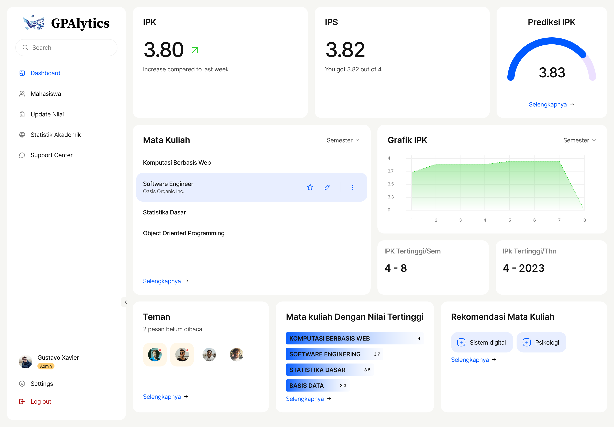

# GPAlytics

GPAlytics is a web-based platform developed by Group 9 to assist students in monitoring, analyzing, and planning their academic progress through grade tracking and GPA prediction.


---

🛠 Technologies Used

- ⚛️ React.js (Frontend)
- 📦 Node.js & NPM
- 📈 Chart.js / Recharts
- 🧠 Predictive algorithms based on statistics
- 🎨 CSS / Tailwind / Bootstrap (optional)
- 🔐 Authentication (basic session/login or Firebase/DB, depending on implementation)

---

🚀 Installation & Running the Project

1. Clone the repository
   git clone https://github.com/fikriaf/GPAlytics_React.git
   cd GPAlytics_React

2. Install dependencies
   npm install

3. Run locally
   npm start

The application will run at http://localhost:3000.

---

👥 Development Team

- Daffa Ma'ruf — 20023071008  
- Fikri Armia Fahmi — 2023071018  

---

🎯 System Objectives

1. Provide deep insights into students' grade progression.
2. Help understand academic grade trends.
3. Offer strategic recommendations to achieve desired GPA targets.

---

📌 Scope

- Input of grades and credit hours for each course.
- GPA calculation and prediction.
- Academic data visualization.
- Academic recommendations based on trend analysis.
- Access restricted to registered users.
- Built using the Waterfall Methodology.

---

⚙️ Main Features

- ✅ Input/Edit course grades
- 📈 Future GPA prediction
- 📊 Grade and trend data visualization
- 🧠 AI/statistics-based academic recommendations
- 🔐 User account management (admin)

---

👤 User Characteristics

- Students aiming to monitor and enhance their academic performance.

⚠️ System Limitations

- System accuracy depends on the validity of the input data.
- The system serves as an aid, not a replacement for academic advisors.

---

📋 System Requirements

Functional
- Input/edit/delete grade data.
- Calculate and predict GPA.
- Display charts and recommendations.
- Account management by admin.

Non-Functional
- ✅ Responsive on mobile and desktop.
- 🔒 Encrypted student data.
- ⚡ Fast processing (< 2 seconds).

---

✅ User Stories

- As a student, I want to input my grades to track my performance.
- As a student, I want GPA predictions to plan my academic path.
- As an admin, I want to manage user accounts to ensure system security.

---

📌 Use Case List

| ID     | Use Case Name             | Actor     |
|--------|---------------------------|-----------|
| UC-01  | Login                     | Student   |
| UC-02  | Register                  | Student   |
| UC-03  | Input Grade Data          | Student   |
| UC-04  | Edit Grade Data           | Student   |
| UC-05  | Calculate GPA             | System    |
| UC-06  | Predict GPA               | System    |
| UC-07  | Data Visualization        | System    |
| UC-08  | Academic Recommendations  | System    |
| UC-09  | Manage User Accounts      | Admin     |
| UC-10  | Reset Password            | Admin     |
| UC-11  | Logout                    | Student   |

---

📈 Flowchart & BPMN

The Flowchart and BPMN diagrams illustrate the process from student login, grade input, to the system providing analysis and recommendations.

Please refer to docs/flowchart.png and docs/bpmn-diagram.bpmn if available.

---

🎨 UI/UX Draft

The interface design can be viewed on Figma:  
🔗 UI Mockup - Figma: https://www.figma.com/design/x93XpAVKqOsNasEp0KbngM/...

---

📁 Folder Structure
```bash
gpalytics/
├── public/
├── src/
│   ├── components/
│   ├── pages/
│   ├── utils/
│   └── App.jsx
├── package.json
└── README.md
```
---

✅ Conclusion

GPAlytics is an academic assistance system that applies sound software engineering principles. With predictive and recommendation features, it has the potential to become an essential tool for students. However, prediction accuracy, data security, and user adoption remain key challenges to address.

---

📬 Contact

📧 Email: fikriarmia27@gmail.com

---

📄 License

MIT License © 2024 Group 9
